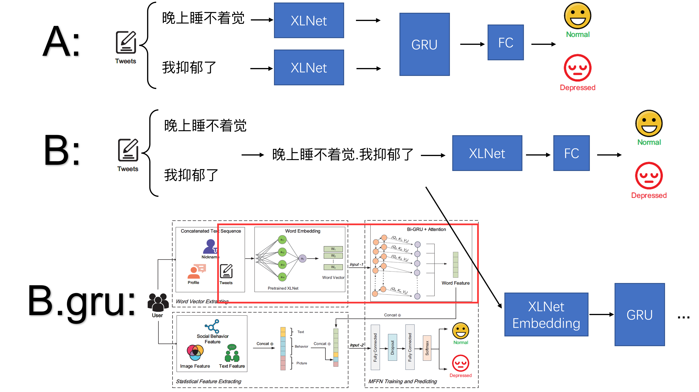

# This project aims at providing baselines for Multimodal Depression Dataset, WU3D.

## Weibo User Depression Detection Dataset (WU3D)
[Dataset Link](https://github.com/aidenwang9867Weibo-User-Depession-Detection-Dataset)
```
|-- main
    |-- data
    |   |-- pic
    |   |   |-- nicknames...
    |   |-- json_files (depressed.json, normal.json)
    |   |-- myIndex.npy
    |-- code  # store my code
        |-- models
        |   |-- baselines.py
        |-- utils
        |   |-- utils.py
        |-- main.py
        |-- train.py
        |-- ...
```
<details open>
<summary>Modality:</summary>

- [x] Text
- [ ] Image TODO
</details>


## Methods:

**In our code, depressed label is set as 1**

We provide two methods. 

A (dataloader.py): we split tweets and preprocess them solely. Sample $A = [[a_1], [a_2], [a_3]]$ 

B(dataloader_splcie.py default): we splice tweets into one sentence as the original paper does. Sample $A = [a_1, a_2, a_3]$



## TODO List
- [ ] Multimodal Baselines
- [ ] Simplify dataloader_splice.py

## How to Use :

Keep you root in main/code/

1.download images to main/data/pic

```bash
cd /path/main/data
mkdir pic
python get_images.py
```

2.Use our dataset partition (myIndex.npy) directly --> pass to Step 2 **(Recommended)**


3.Run Code

```bash
cd /path/main/code
python main.py
```

*.If you hope to create your own dataset partition (Optional) 

```bash
python utils/create_index.py
```

## Explanation:
Firstly, we ignore repeating users. Besides, users with numbers of original tweets or contents less than 2 (<=1) are deleted. 

**Dataloader:** 

(For Method 1 ) To make the program with batch size greater than 1 works, we rearrange samples according to their numbers of valid tweets ($count$). Thus, ```shuffle``` is set as ```False``` in default. We only select the first **ten** tweets. In a batch of sample (A, B, C), if $count_A$ is smaller than $count_C$, we use zero padding to keep them aligned. (在dataloader中，为了使得程序在batch size > 1时也能运行，我们对每个样本按照它的有效微博数$count$ 重新进行排序，并且只取前10个微博。在一个batch中，所有样本的长度和最后一个保持一致，不足的部分补零。不过我不知道这样做不知道会不会有什么问题。方法B的话就不需要这么做，不过目前还是保留了这样的做法，暂不确定对精度有多少影响。之后会继续改进)

In DataLoader Splice, we simplify the process, please refer to dataloader_splice.py / ```def __getitem__() ```part

If you have any better idea, please inform me or pull a reguest. 

Following prior works, we keep the numbers of positive and negative samples consistent. we split the dataset into the standard train/validation/test sets with the ratio of **7 : 1 : 2**. 

We recommend using our dataset partition so everyone can have fair comparisons.

Please feel free to open an issue.

## Results on the test set
参数都没有细调，随便跑的实验

| Method | Partition | Data | Accuracy | F1-score | Precision | Recall |
|:---|:---:|:---:|:---:|:---:|:---:| :---: |
|[1]Fine-tuning XLNet | 0.2 | Splice | 92.74 | 92.83 | 95.74 | 90.09 |
|[1.1]Fine-tuning XLNet | 1 | Splice |  |  |  |  |
|[1.2]Fine-tuning RoBERT | 0.2 | Splice | 91.39 | 91.73 | 91.94 | 91.51 |
|[2]XLNet Embedding + GRU | 0.2 | Splice | not good |  |  | |
|[3]XLNet + GRU | 0.2 | Split | 90.41 | 90.64 | 92.20 | 89.15 |
|MFFN * | 1 | Splice | 96.83 | 96.85 | 99.08 | 94.72 |

[1] *Fine-tuning XLNet-Base : the xlnet we used are pre-trained on a binary-class dataset. We apply it directly without modification.*
```bash
python main.py --split-ratio 0.2 --loader-mode splice --baseline finetune
```

[2] *Similar to the original paper, we adopt the embedding layer of XLNet and freeze it. What's more, we use a Bi-GRU whose hidden units are 128. You can refer to baseline.py for more details. To be notice, this method dosen't work well.*

```bash
python main.py --split-ratio 0.2 --loader-mode splice --baseline gru
```

[3] *Handle tweets individually. Apply a GRU or LSTM in the end. This method is computational expensive and less effective (10x slower). We assume that the GRU limits its performance.*

```bash
python main.py --split-ratio 0.2 --loader-mode split
```

MFFN \* is propose in the following paper. The authors use a different setting.

#### Conclusion

虽说和原论文的实验设置不同（他们按照8:1:1划分，我的实验只用了20%的数据等等)，但微调XLNet没干过论文里的GRU baseline (95的Acc和F1)属实有点尴尬，等我有空把'按照count排序'这一块删了再战

## Citation

```
@INPROCEEDINGS{9391501,
author={Wang, Yiding and Wang, Zhenyi and Li, Chenghao and Zhang, Yilin and Wang, Haizhou},
booktitle={2020 IEEE 39th International Performance Computing and Communications Conference (IPCCC)}, 
title={A Multimodal Feature Fusion-Based Method for Individual Depression Detection on Sina Weibo}, 
year={2020},
volume={},
number={},
pages={1-8},
doi={10.1109/IPCCC50635.2020.9391501}}
```
